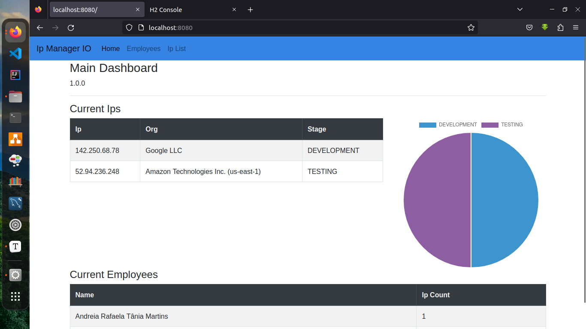
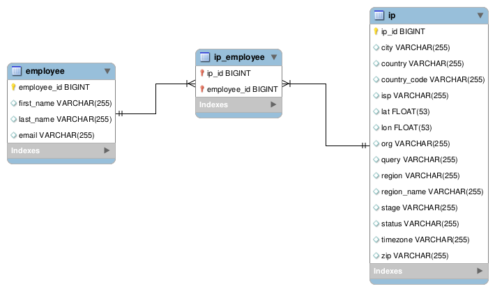

# IP Manager :coffee:

## Java Program to Assign IPs to Employees

#### This program is part of the "Orange Tech + | BackEnd" course offered by [DIO](https://www.dio.me)  tutored by [Venilton Falvo Jr](https://www.linkedin.com/in/falvojr/) and [Camila Cavalcante](https://github.com/cami-la). :satisfied:

### Powered by:

### 

### Modules

*  Spring Data JPA

*  Spring Web

*  H2 Database

*  OpenFeign

*  Spring DevTools

*  Thymeleaf

### Consider a company that manages multiple IP addresses and wants a system that links the IPs to their employees. 

## MER

[Javadoc](./doc/index.html)

